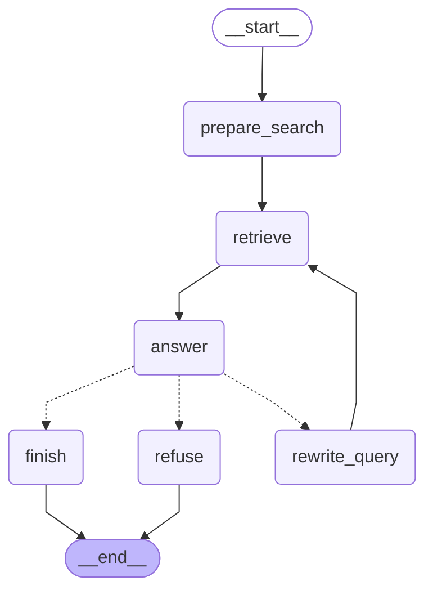

# Assignment 6: Rebuild the RAG Assistant as a LangGraph Agent
## Setup

```bash
python -m venv .venv
python -m pip install -e ".[dev]"
```

Activate the environment on Windows:

```bash
.venv\Scripts\Activate.ps1
```
## Run
```bash
python -m ticket_assistant.run
```
Commands:
- `/reset` clears the conversation.
- `/quit` exits the agent.

## Graph

The application uses a compiled LangGraph `StateGraph`.



The retry cycle is:

```text
answer -> rewrite_query -> retrieve -> answer
```

The graph is allowed two attempts to find something. If the answer is still not_grounded after the second attempt, the agent refuses.

Messages accumulate in the graph state, and an in-memory checkpointer supports multi-turn conversations.

## Unsupported Question

The documents intentionally do not cover this question:
- The assistant should respond: The provided documents do not cover that question.

## Tests
Tests run without AWS credentials or network access:

```bash
pytest -v
```

The tests cover:

- Document loading and splitting
- Graph nodes and edges
- Conditional routing
- The retry limit

